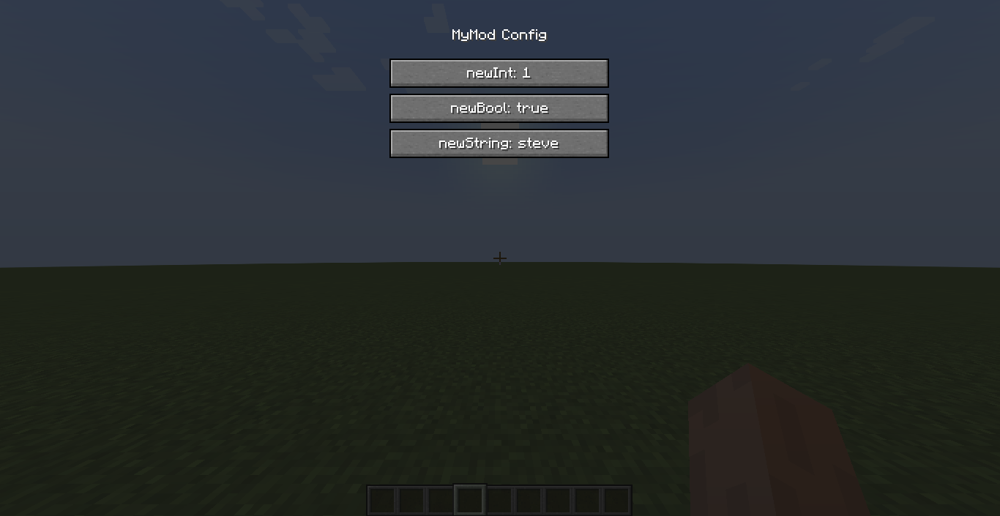
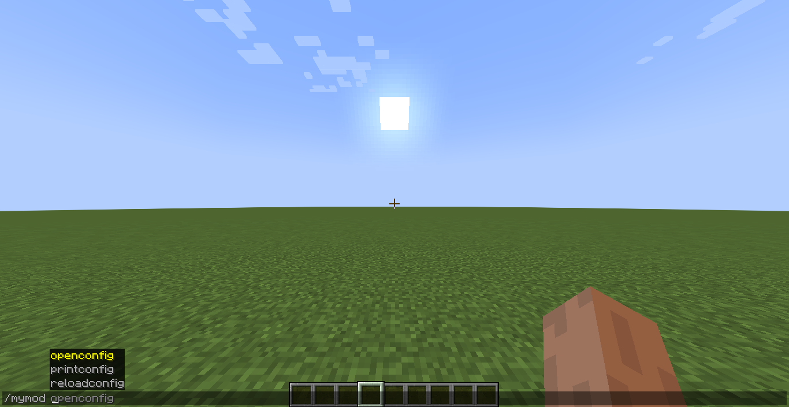
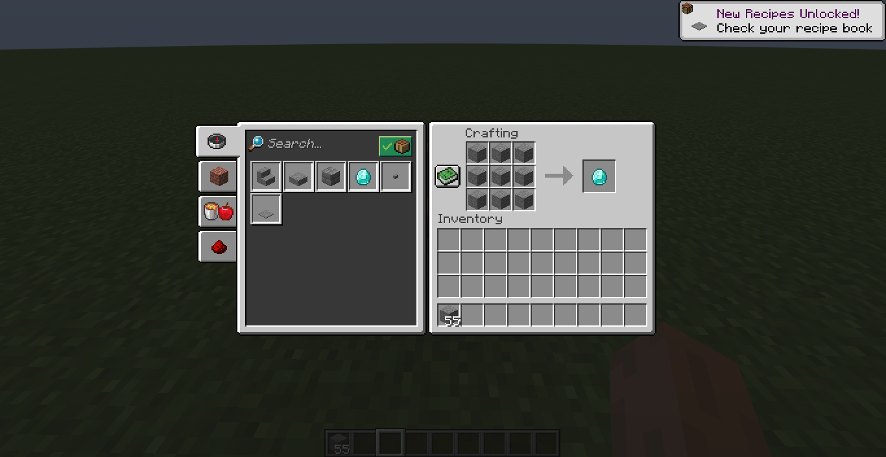

# MJs MultiLoader Template

[](https://www.minecraft.net/)
[](LICENSE)
[](https://discord.gg/NXAtHbcdpY)

A robust but easy and ready to use **Multi-Loader Template for Minecraft Modding**,  supporting **Forge** and **Fabric** with a shared **Common module**. Perfect for anyone who needs an **Updated Template** for these Minecraft Versions !

---

## Included Features

This template comes packed with features:

- ✅ **Multi-loader setup** – Forge and Fabric support with shared Common code.
- ✅ **Data generation** – Working Example setups for Recipes, etc.
- ✅ **Mixin example** – Working ready to use Mixin and Refmap.
- ✅ **Client & server commands** – Example Commands for both sides.
- ✅ **JSON config system & screen** – Inbuilt Configuration UI & Data handling.
- ✅ **Jar** – Sources jar, Javadoc jar, custom jar name.
- ✅ **Class access** – Forge, Fabric access transformer / widener.

-- version: 0.1

---


## Getting Started

Run this in your IDE Terminal or download this zip, extract it and open it in your preferred IDE.
```bash 
git clone https://github.com/mjdev83/MJs-MultiLoader-Template cd {folder}
```

You only need to change a few things to test it-

1. rootProject.name = {"root-folder-name"} in 'settings.gradle'.
2. the Project SDK must be set to 'Java 17'.


---


## Previews

Config Screen:


Commands: 


Recipe: 



---


### Note

1. You cannot redistribute 'This Template', whether as is or modified !
2. You can use 'This Template' and modify it to make 'Your Mods' and use any Licence you want for 'Your Mods' !
3. You don't need to provide credit in 'Your Mods' but, appreciated (optional) in your 'Mods GitHub repo' if it has one.
4. For more info, see - [LICENSE](LICENSE)
5. For more queries or to discuss join our [Discord Server](https://discord.gg/NXAtHbcdpY)


---


## Dev Guide

Once the test is done now you can change things -

- change Package - replace 'com.myname.mymod' with your own: rename it in one module and select 'All Directories' so IDE auto-renames other modules.

- change the Properties - in 'root/gradle.properties', those came with this template are expanded in 'root/build.gradle'.

- Common holds the main vanilla code - we register it in 'Fabric / Forge', 'Common 'does not have access to 'Forge & Fabric', 'Forge & Fabric' does not have access to each other but 'Common', most of the possible code will be in the 'Common'.

- adding and removing Loaders - remove the loader from 'settings.gradle' and delete "/MJs-MultiLoader-Template/loader" folder.

- Plugins management - main is done in 'settings.gradle', added in 'root/build.gradle' and  applied in 'loader/build.gradle'.

- MC version - this Template ships with major Modded MC versions, but it can be easily adjusted for other MC versions by changing 'gradle.Properties' values and 'plugin' versions.

### Contact

- my Discord: @mjdev83